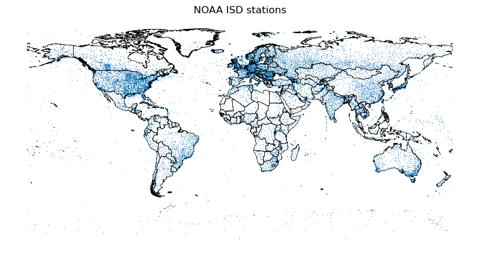

.. _context:

Presenting the data
===================

Available Weather Variables
---------------------------

The ISD Lite dataset provides the following weather variables:

- ``temp``: Air temperature (°C)
- ``dewtemp``: Dew point temperature (°C)
- ``pressure``: Sea level pressure (hPa)
- ``winddirection``: Wind direction (degrees)
- ``windspeed``: Wind speed (m/s)
- ``skycoverage``: Sky coverage/ceiling (code)
- ``precipitation-1h``: One-hour precipitation (mm)
- ``precipitation-6h``: Six-hour precipitation (mm)

Station Coverage
----------------

The ISD Lite network includes thousands of weather stations worldwide.

